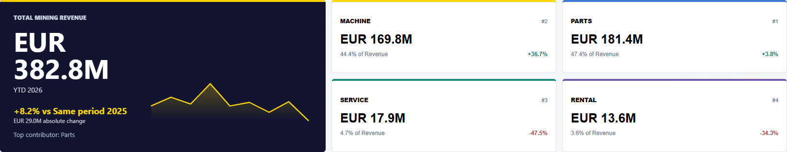
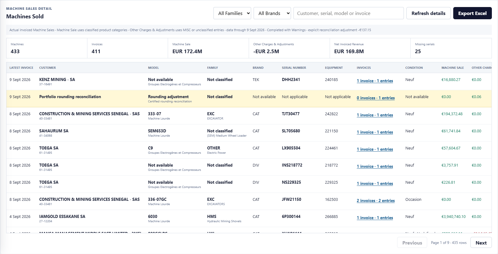
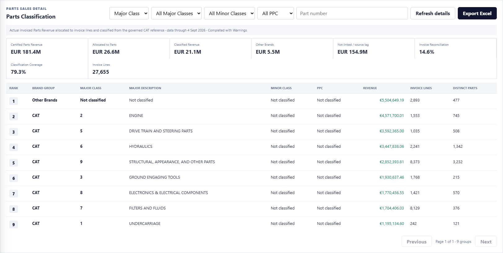
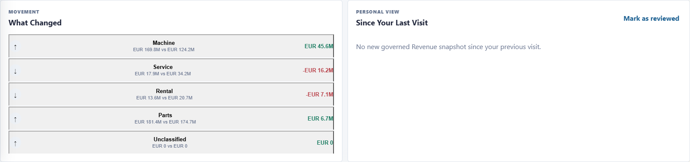
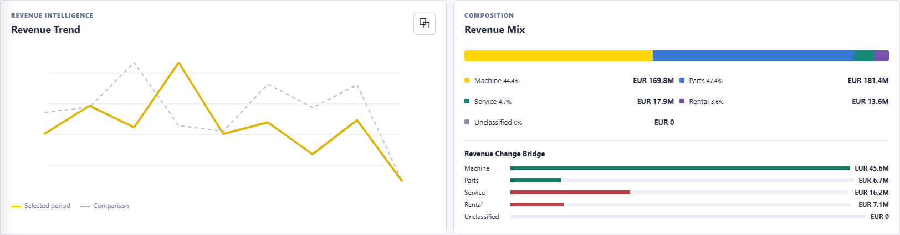
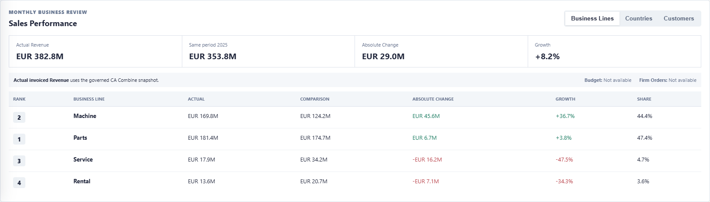
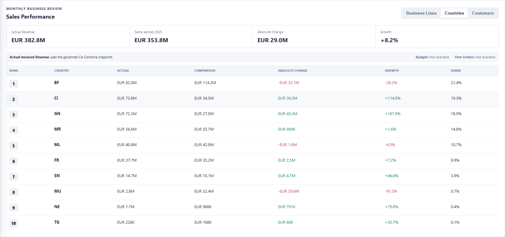
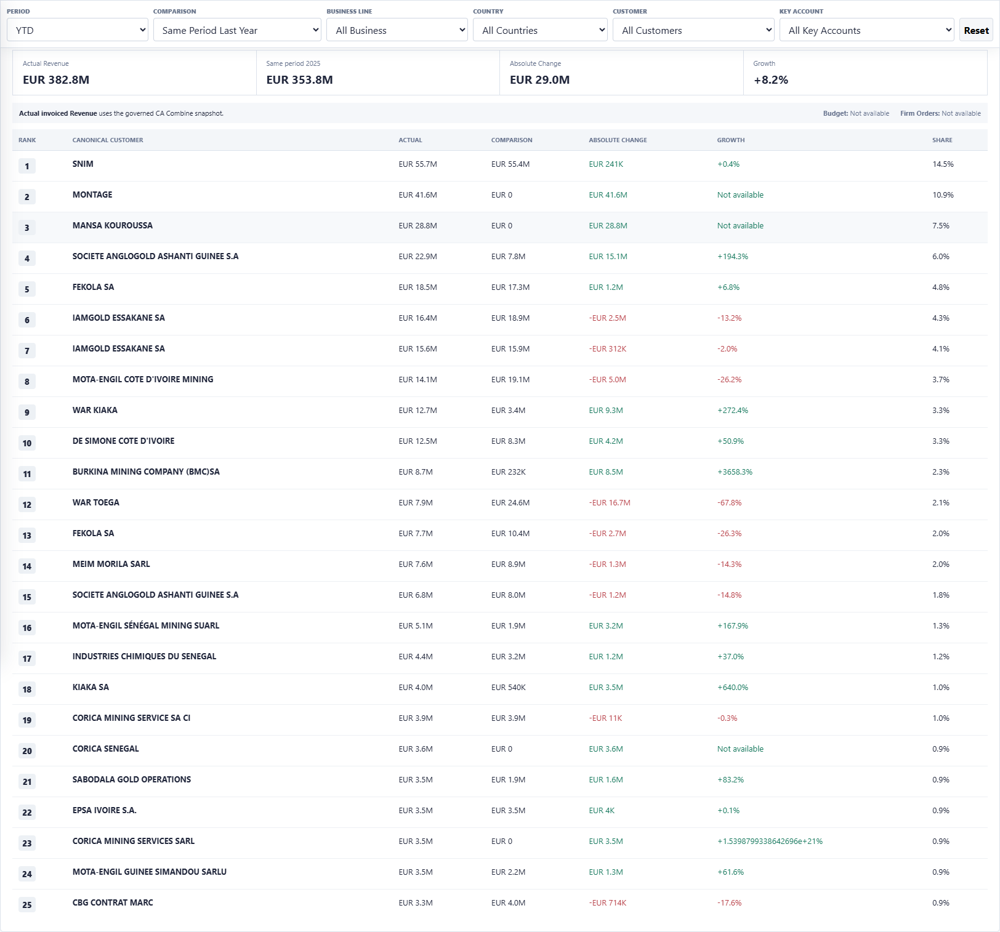
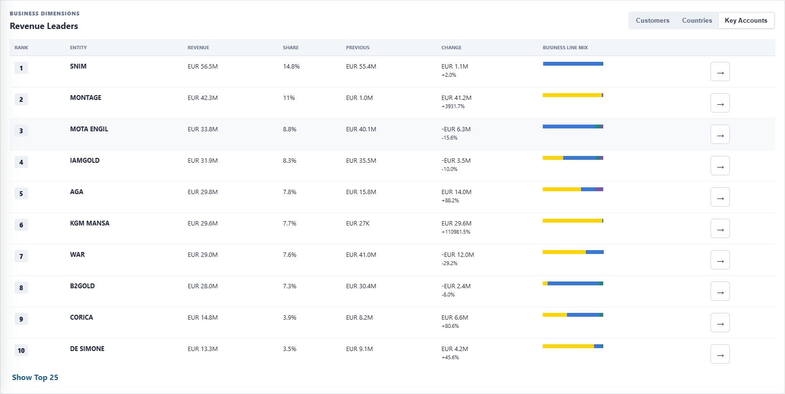
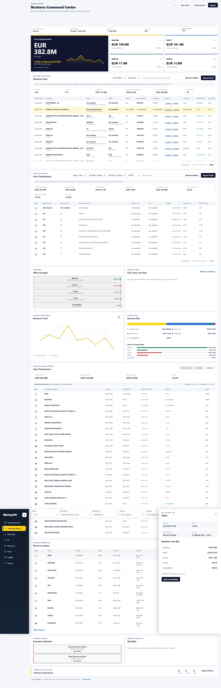

# Mining 360 - Business Command Center

## Dossier de présentation et d'analyse

Date de la capture : 14 septembre 2026  
Environnement : Mining 360 Development  
Route : `/business-review/command-center/`  
État de Mapping utilisé : publication version 5  
Dernière date Revenue disponible : 11 septembre 2026  
Devise de reporting : EUR

> Confidentialité : les captures contiennent des noms de clients, des chiffres d'affaires et des informations commerciales réelles. Elles doivent être transmises uniquement dans un espace ChatGPT autorisé par Neemba.

## 1. Résumé du produit

Le Business Command Center est la page exécutive de Business Review dans Mining 360. Son objectif est de donner, sur un seul écran, une vision gouvernée du chiffre d'affaires Mining et de ses principaux axes d'analyse.

Il répond principalement aux questions suivantes :

- Quel est le chiffre d'affaires Mining facturé sur la période ?
- Quelle Business Line contribue le plus : Machine, Parts, Service ou Rental ?
- Quelle est l'évolution par rapport à la période comparable ?
- Quels clients, pays et Key Accounts produisent le plus de chiffre d'affaires ?
- Quels segments progressent et lesquels reculent ?
- Quelles machines ont été vendues, à quels clients et pour quels montants ?
- Comment les ventes de pièces CAT se répartissent-elles par Major Class, Minor Class et PPC ?
- Quel niveau de confiance peut-on accorder aux dimensions Customer, Country et Key Account ?
- Quelles anomalies ou baisses nécessitent l'attention du management ?

Le Command Center n'est pas une page de configuration. La classification des comptes et la publication des relations sont réalisées dans Business Mapping Studio. Le Command Center consomme uniquement la dernière version publiée.

## 2. Vue exécutive actuelle

Pour le YTD 2026, du 1er janvier au 11 septembre 2026, le snapshot réel affiche :

| Indicateur | Valeur actuelle | Même période 2025 | Évolution | Part du total |
|---|---:|---:|---:|---:|
| Total Mining Revenue | 382 826 978,14 EUR | 353 834 284,96 EUR | +8,2 % | 100 % |
| Machine | 169 848 249,57 EUR | 124 205 981,27 EUR | +36,7 % | 44,4 % |
| Parts | 181 427 305,01 EUR | 174 742 058,94 EUR | +3,8 % | 47,4 % |
| Service | 17 947 468,73 EUR | 34 181 545,71 EUR | -47,5 % | 4,7 % |
| Rental | 13 603 954,83 EUR | 20 704 699,05 EUR | -34,3 % | 3,6 % |
| Unclassified | 0,00 EUR | 0,00 EUR | Non applicable | 0 % |

La somme Machine + Parts + Service + Rental + Unclassified est réconciliée avec le total affiché, avec une différence de 0,00 EUR pour une tolérance de 0,01 EUR.

## 3. Provenance du Revenue principal

### Source officielle utilisée

Le Revenue principal provient du modèle sémantique Power BI :

- Rapport/source métier : `Customer Fleet & Revenue Planning Model` ;
- identifiant du modèle sémantique : `a67ebcac-97d0-4d46-b84d-8109cd2c804a` ;
- table Revenue : `ChriffreAffaire` ;
- source amont identifiée : base NMBEPM ;
- montant : `ChriffreAffaire[CA euro]` ;
- date métier : `ChriffreAffaire[Date ecritures]` ;
- client : `ChriffreAffaire[Code client Irium]` et `ChriffreAffaire[Nom client]`.

### Périmètre Mining

Le buffer Revenue applique les règles suivantes :

- `Division = MI` ;
- exclusion du canal de distribution `INTERCO` ;
- conservation des montants négatifs, notamment les avoirs, corrections et extournes présents dans `CA euro` ;
- conservation des quatre dernières années métier dans le snapshot quotidien ;
- aucune somme de devises différentes : le Command Center utilise le montant consolidé en EUR fourni par la source.

### Classification des Business Lines

| Code source LOB | Business Line affichée |
|---|---|
| `PRIME` | Machine |
| `PARTS` | Parts |
| `SERVICE` | Service |
| `RENTAL` | Rental |
| valeur non reconnue | Unclassified |

Les mesures `[CA PRIME]` et `[CA PARTS]` sont exposées et réconciliées dans le modèle sémantique. Service et Rental utilisent actuellement la somme gouvernée de `CA euro` filtrée sur leur LOB, car aucune mesure certifiée dédiée n'a encore été identifiée pour ces deux lignes.

Le legacy measure `[Total CA]` n'est pas utilisée comme total des quatre lignes, car elle ne couvre que PRIME et PARTS. Le total du Command Center est construit sur le même fait Revenue et réconcilié avec les quatre Business Lines.

## 4. Chaîne de données

Le flux applicatif est le suivant :

```text
NMBEPM
  -> Customer Fleet & Revenue Planning semantic model
  -> lecture contrôlée de ChriffreAffaire
  -> RevenueSourceSnapshot dans la base Mining 360
  -> publication Business Mapping version 5
  -> BusinessCommandCenterService
  -> API Bootstrap Business Review
  -> interface AJAX du Business Command Center
```

Les appels Power BI ne sont pas exécutés séparément pour chaque carte. Les données nécessaires sont synchronisées dans des tables buffer de Mining 360. La page agrège ensuite ces snapshots avec le Mapping publié.

Le premier écran utilise :

- une publication de Mapping donnée ;
- un run de synchronisation Revenue donné ;
- une date maximale de données donnée ;
- une version de règles métier ;
- un contexte utilisateur et ses autorisations.

## 5. Business Mapping publié

La version actuelle du Command Center utilise `MappingPublication version 5`.

Le Mapping publié relie les codes clients sources à :

- un Canonical Account ;
- un pays d'exercice gouverné ;
- éventuellement un Key Account ;
- les autres relations publiées disponibles, notamment les MineSites.

Les brouillons, suggestions et mappings seulement validés ne sont pas utilisés. Une modification effectuée dans Business Mapping Studio n'affecte le Command Center qu'après publication d'une nouvelle version.

État de couverture actuel sur le Revenue YTD :

| Dimension | Couverture Revenue |
|---|---:|
| Canonical Customer | 100,0 % |
| Country | 100,0 % |
| Key Account | 85,7 % |
| Revenue non alloué | 0,00 EUR |
| Revenue non classifié par Business Line | 0,00 EUR |

La couverture Key Account inférieure à 100 % est normale : certains Canonical Accounts n'appartiennent à aucun Key Account. Ils restent visibles dans le total, dans Customer et dans Country.

## 6. Filtres et périodes

La barre supérieure pilote toute la page par intersection :

- Period ;
- Comparison ;
- Business Line ;
- Country ;
- Customer ;
- Key Account.

Les identifiants canoniques sont utilisés dans les requêtes, pas les noms d'affichage.

### YTD

Du 1er janvier de la dernière année disponible jusqu'à la dernière date Revenue disponible. Dans la capture : du 1er janvier au 11 septembre 2026.

### Last Year

Année civile complète précédant la dernière année disponible. Avec des données 2026, Last Year correspond au 1er janvier au 31 décembre 2025.

### Current Month

Du premier jour du mois contenant la dernière date Revenue jusqu'à cette dernière date. La période ne va pas artificiellement jusqu'à la fin du mois.

### Custom Range

Intervalle inclusif entre Start Date et End Date, limité à la fenêtre de quatre ans conservée. La date de fin ne peut pas dépasser la dernière date Revenue disponible.

### Comparaisons

- Same Period Last Year ;
- Previous Equivalent Period ;
- No Comparison.

Les changements de filtre utilisent AJAX, mettent à jour l'URL et ne rechargent pas toute la page.

## 7. Revenue Hero et Business Line Pulse

Le premier écran présente :

- le Total Mining Revenue ;
- la période active ;
- l'évolution relative ;
- l'évolution absolue ;
- le principal contributeur ;
- une tendance compacte ;
- les quatre cartes Machine, Parts, Service et Rental ;
- le rang et la part de chaque ligne.

Cliquer sur une Business Line applique le filtre à toute la page. Le Revenue Hero devient alors, par exemple, le Parts Revenue, et les tendances, classements et comparaisons sont recalculés sur Parts uniquement.



## 8. Machines Sold

La section Machines Sold fournit un détail opérationnel des montants PRIME facturés.

### Source

La synchronisation utilise la même table sémantique `ChriffreAffaire`, filtrée sur :

- `Division = MI` ;
- `LOB = PRIME` ;
- canal différent de `INTERCO` ;
- fenêtre des quatre dernières années.

Les champs utilisés comprennent :

- Date ecritures ;
- Code client Irium ;
- Nom client ;
- Code Equipement ;
- N° de série ;
- Produits détails ;
- Facture ;
- Etat machine ;
- Code constructeur ;
- Libellé constructeur ;
- CA euro.

Une requête SQL NMBEPM documentée existe également pour la lecture directe des tables analytiques `ana_f_ecriture_analytique`, `equ_d_equipement`, `equ_d_modele_equipement` et `tie_d_tiers`, mais le chemin actif de synchronisation utilise actuellement le modèle sémantique contrôlé.

### Enrichissement Machine

Les ventes sont enrichies dans Mining 360 avec :

- le numéro de série ;
- le préfixe correspondant aux trois premiers caractères ;
- le modèle ;
- la famille produit ;
- la famille stratégique HMS, LMT ou OHT lorsque la règle s'applique ;
- la marque, notamment CAT et Epiroc ;
- l'état neuf ou occasion.

Les référentiels utilisés sont les tables Mining 360 alimentées à partir des fichiers Serial/Prefix/Model et Product Group fournis, complétées par `EquipmentList_MiningProd` lorsque l'équipement est connu dans la flotte.

### Séparation Machine Sale / Other Charges

- `Machine Sale` : lignes dont la catégorie produit identifie une vente machine ;
- `Other Charges & Adjustments` : catégories MISC, Undefined ou non classifiées ;
- `Net Invoiced Revenue` : Machine Sale + Other Charges & Adjustments.

Le Net Invoiced Revenue est réconcilié avec la carte Machine certifiée. État actuel :

| Indicateur | Valeur |
|---|---:|
| Machines regroupées | 433 |
| Numéros de série distincts | 405 |
| Factures | 411 |
| Lignes de détail source | 722 |
| Machine Sale | 172 374 728,10 EUR |
| Other Charges & Adjustments | -2 526 478,53 EUR |
| Net Invoiced Revenue | 169 848 249,57 EUR |
| Numéros de série manquants | 25 |
| Ajustement de réconciliation | -137,15 EUR |
| Fraîcheur du détail Machine | 9 septembre 2026 |

La section permet de filtrer par Family et Brand, de chercher par Customer, serial, model ou invoice, d'ouvrir les écritures d'une machine et d'exporter le tableau vers Excel.



## 9. Parts Classification

Cette section rapproche le CA Parts certifié avec les lignes de factures et le référentiel de classification CAT.

### Sources de rapprochement

- CA Parts certifié : `RevenueSourceSnapshot`, issu de CA Combine / `ChriffreAffaire` ;
- écritures comptables : `ReconciliationAccountingEntry` ;
- liens livraison-facture : `ReconciliationDeliveryInvoiceLink` ;
- lignes de commande : `ReconciliationOrderLine`, utilisées notamment pour la marque ;
- référentiel pièces : `PartClassificationReference` et `PartsMajorClassReference` ;
- fichier de référence fourni : `Liste_pieces_CAT_S1_2026 (2).xlsb`.

Le montant comptable certifié d'une facture est réparti entre ses lignes au prorata du montant net de chaque ligne. La dernière ligne absorbe le reliquat d'arrondi. Les références CAT sont classées par Major Class, Minor Class et PPC. Les marques non-CAT sont totalisées dans `Other Brands`.

### Major Classes CAT

La vue actuelle affiche les huit codes Major Class CAT présents dans le référentiel chargé :

1. Undercarriage ;
2. Engine ;
3. Ground Engaging Tools ;
5. Drive Train and Steering Parts ;
6. Hydraulics ;
7. Filters and Fluids ;
8. Electronics & Electrical Components ;
9. Structural, Appearance, and Other Parts.

Les marques non-CAT sont présentées séparément sous `Other Brands` et ne reçoivent pas artificiellement une Major Class CAT.

### État de couverture actuel

| Indicateur | Valeur |
|---|---:|
| Parts Revenue certifié | 181 427 305,01 EUR |
| Revenue rattaché aux lignes de pièces | 26 569 580,72 EUR |
| Revenue CAT classifié | 21 064 931,53 EUR |
| Other Brands | 5 504 649,19 EUR |
| Revenue non lié / décalage source | 154 857 724,29 EUR |
| Couverture de rapprochement facture | 14,6 % |
| Couverture de classification sur le sous-ensemble lié | 79,3 % |
| Couverture CAT classifiée de bout en bout | 11,6 % |
| Lignes de factures classifiables | 27 655 |
| Fraîcheur du détail Parts | 4 septembre 2026 |

Point essentiel : la distribution Major Class ne représente actuellement que les factures Parts qui ont pu être reliées aux lignes de pièces. Elle ne doit pas être interprétée comme une répartition complète des 181,4 M€ tant que la couverture de rapprochement reste à 14,6 %.



## 10. What Changed et Since Your Last Visit

`What Changed` compare la période sélectionnée à la période de comparaison. Les faits sont déterministes et classés par importance absolue. Ils montrent notamment les hausses et baisses par Business Line.

`Since Your Last Visit` utilise `BusinessCommandCenterUserVisit`. Mining 360 mémorise pour chaque utilisateur :

- le hash de son contexte de filtres ;
- le snapshot précédemment consulté ;
- l'heure de consultation ;
- le dernier total autorisé qu'il a vu.

Cette fonction ne compare pas deux utilisateurs et ne stocke pas un export complet des données.



## 11. Revenue Trend, Revenue Mix et Change Bridge

La tendance Revenue regroupe les montants par mois sur la période active et superpose la période comparable.

Revenue Mix montre la contribution de chaque Business Line au total. Les valeurs exactes restent visibles à côté de la barre de composition.

Revenue Change Bridge explique l'écart entre la période actuelle et la comparaison :

- contribution positive Machine ;
- contribution positive Parts ;
- contribution négative Service ;
- contribution négative Rental ;
- contribution Unclassified.



## 12. Sales Performance

La section Sales Performance permet trois lectures cohérentes du même Revenue :

- Business Lines ;
- Countries ;
- Customers.

Les colonnes présentent le rang, la valeur actuelle, la valeur comparable, la variation absolue, le taux de croissance et la part du total.

Le bloc indique explicitement que :

- le Revenue réel facturé est disponible ;
- le Budget certifié n'est pas encore disponible ;
- les Firm Orders ne sont pas encore intégrés dans cette vue exécutive.







## 13. Revenue Leaders

Revenue Leaders propose trois onglets :

- Customers ;
- Countries ;
- Key Accounts.

Chaque ligne contient :

- rang ;
- entité canonique ;
- Revenue ;
- part du total ;
- Revenue de comparaison ;
- variation ;
- mix Machine/Parts/Service/Rental ;
- accès au drawer 360.

Le classement est effectué du Revenue le plus élevé au plus faible. L'utilisateur peut afficher le Top 10 ou le Top 25.



## 14. Drawers 360

Cliquer sur une ligne ouvre un panneau sans quitter le Command Center. Le drawer affiche :

- Revenue de l'entité ;
- part du total ;
- Revenue de comparaison ;
- variation ;
- mix par Business Line ;
- version de Mapping publiée ;
- action d'ajout à la Watchlist.



## 15. Executive Attention

Les signaux actuels sont générés par des règles déterministes, pas par un LLM. Sur le snapshot capturé :

- Service Revenue declined : impact de 16,23 M€ ;
- Rental Revenue declined : impact de 7,10 M€.

Une baisse est signalée parce que la variation absolue par rapport à la période comparable est négative. Ce signal ne prétend pas expliquer la cause de la baisse.


## 16. Watchlist, Actions et décisions

La Watchlist est personnelle. Elle peut contenir des Customers, Countries ou Key Accounts ajoutés depuis les drawers. Elle ne modifie pas les permissions.

Le bloc Actions & Decisions résume :

- les actions Critical ;
- les actions Overdue ;
- les actions Open.

Le snapshot capturé ne contient actuellement aucune action ouverte. Le lien `Open Actions` mène au Control Tower Business Review, où les actions de management sont gérées indépendamment des mappings.


## 17. Sécurité et gouvernance

Le backend applique les autorisations indépendamment du frontend.

Le périmètre Revenue est réduit avec `authorized_account_codes(user)`. Les agrégations, listes, filtres, exports Machine et exports Parts sont calculés après application de ce périmètre.

Le cache inclut notamment :

- l'utilisateur ;
- le run source ;
- la publication ;
- la période ;
- la comparaison ;
- la Business Line ;
- les Customers ;
- les Countries ;
- les Key Accounts.

Une réponse en cache destinée à un utilisateur n'est donc pas réutilisée comme réponse autorisée pour un autre utilisateur.

Les sources Power BI et NMBEPM restent en lecture seule. Les décisions de Mapping, visites, Watchlists et actions sont stockées dans la base Mining 360.

## 18. Performance actuelle

Le service utilise un cache de cinq minutes pour le cœur du snapshot. Les éléments personnels, tels que Since Your Last Visit et Watchlist, sont ajoutés après la lecture du cœur partagé.

Mesures antérieures sur un buffer de 29 323 agrégats journaliers :

- bootstrap p50 : 9,1 ms ;
- bootstrap p95 : 12,4 ms ;
- maximum de 11 requêtes ORM ;
- un appel bootstrap normal.

La capture réelle actuelle a toutefois révélé un payload bootstrap d'environ 1,7 Mo, principalement parce que 3 870 Customers sont renvoyés dans les dimensions et les options de filtres. Cela doit être optimisé par pagination et autocomplete AJAX avant un déploiement à plus grande échelle.

## 19. Limites actuelles à présenter clairement

1. Service et Rental n'ont pas encore de mesures sémantiques certifiées dédiées.
2. La logique amont complète de conversion EUR, taxes, statuts de facture et annulation n'est pas entièrement exposée par le modèle sémantique.
3. Le Revenue principal est frais au 11 septembre 2026, le détail Machine au 9 septembre et le détail Parts au 4 septembre. Ces dates doivent être alignées ou affichées plus fortement.
4. La couverture Key Account est de 85,7 %, car certains comptes n'appartiennent à aucun Key Account.
5. Le rapprochement Parts facture-lignes n'est que de 14,6 %. La classification Major/Minor/PPC n'est donc pas encore représentative de la totalité du Revenue Parts.
6. Vingt-cinq ventes Machine regroupées n'ont pas de numéro de série.
7. Certains modèles et familles Machine restent `Not available` ou `Not classified`.
8. Budget, Firm Orders, Forecast et Sales Funnel ne sont pas encore raccordés au Command Center.
9. Executive Attention identifie des variations, mais ne fournit pas encore une analyse causale complète.
10. Le bootstrap doit être allégé : les milliers de Customers doivent être chargés par recherche serveur et pagination.

## 20. Suggestions d'optimisation à demander à ChatGPT

Lors de l'analyse des captures, demander en priorité :

- comment renforcer la hiérarchie visuelle du premier écran ;
- quelles sections doivent être remontées ou descendues pour un usage exécutif quotidien ;
- comment réduire la densité de Machines Sold et Parts Classification sans perdre le drill-down ;
- comment afficher clairement les dates de fraîcheur différentes ;
- comment rendre la couverture Parts de 14,6 % impossible à mal interpréter ;
- comment améliorer le drawer Customer/Country/Key Account 360 ;
- comment intégrer Budget, Firm Orders et Forecast comme couches séparées du Revenue réel ;
- comment améliorer Executive Attention avec des seuils métier gouvernés ;
- comment optimiser les filtres Customer et Key Account avec autocomplete AJAX ;
- comment améliorer l'expérience mobile sans masquer les limites de données.

## 21. Catalogue des captures

1. [Page complète desktop](screenshots/business-command-center-2026-09-14/01-command-center-full-page.png)
2. [Header et contrôles](screenshots/business-command-center-2026-09-14/02-header-and-controls.png)
3. [Executive Revenue Overview](screenshots/business-command-center-2026-09-14/03-executive-revenue-overview.png)
4. [Machines Sold](screenshots/business-command-center-2026-09-14/04-machines-sold.png)
5. [Parts Major Class](screenshots/business-command-center-2026-09-14/05-parts-major-class.png)
6. [What Changed et Since Your Last Visit](screenshots/business-command-center-2026-09-14/06-what-changed-and-last-visit.png)
7. [Revenue Trend, Mix et Bridge](screenshots/business-command-center-2026-09-14/07-revenue-trend-mix-bridge.png)
8. [Sales Performance - Business Lines](screenshots/business-command-center-2026-09-14/08-sales-performance-business-lines.png)
9. [Sales Performance - Countries](screenshots/business-command-center-2026-09-14/09-sales-performance-countries.png)
10. [Sales Performance - Customers](screenshots/business-command-center-2026-09-14/10-sales-performance-customers.png)
11. [Key Account Revenue Leaders](screenshots/business-command-center-2026-09-14/11-key-account-revenue-leaders.png)
12. [Key Account 360 Drawer](screenshots/business-command-center-2026-09-14/12-key-account-360-drawer.png)
13. [Executive Attention et Watchlist](screenshots/business-command-center-2026-09-14/13-executive-attention-and-watchlist.png)
14. [Actions and Decisions](screenshots/business-command-center-2026-09-14/14-actions-and-decisions.png)
15. [Page complète mobile](screenshots/business-command-center-2026-09-14/15-mobile-full-page.png)

## 22. Prompt conseillé pour l'analyse ChatGPT

```text
Analyse le dossier et les captures du Mining 360 Business Command Center.

Le produit est un cockpit exécutif interne fondé sur du Revenue facturé réel.
Les données principales proviennent de Customer Fleet & Revenue Planning Model,
table ChriffreAffaire, source amont NMBEPM, puis sont persistées dans des snapshots
Mining 360. Les dimensions Customer, Country et Key Account proviennent uniquement
du Business Mapping publié version 5.

Je veux une critique concrète et priorisée portant sur :
1. l'impact exécutif du premier écran ;
2. la hiérarchie visuelle et la densité ;
3. la compréhension des variations ;
4. les parcours Customer, Country et Key Account ;
5. la lisibilité de Machines Sold et Parts Classification ;
6. la communication des différences de fraîcheur ;
7. la communication de la couverture Parts limitée à 14,6 % ;
8. les fonctions manquantes pour une Business Review mensuelle ;
9. les optimisations desktop, laptop, tablette et mobile ;
10. un plan d'amélioration découpé en quick wins, moyen terme et cible premium.

N'invente aucun chiffre ni aucune source. Distingue les améliorations UI des
travaux de gouvernance et de réconciliation des données.
```
